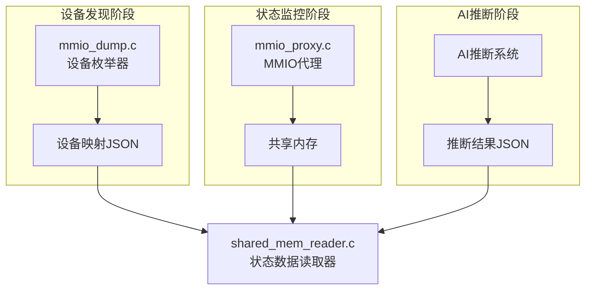

# AI-based Peripheral Register State Inference System

基于AI的外设寄存器状态推断系统 - 利用大模型分析QEMU中ARM外设的MMIO操作历史，推断外设寄存器状态和行为模式。

## 🎯 项目概述

本项目旨在通过监控QEMU模拟器中ARM外设的MMIO（Memory-Mapped I/O）访问，收集完整的系统状态信息，并使用AI大模型来推断外设的寄存器状态、工作模式和潜在问题。

### 核心功能

- **设备自动发现**: 自动枚举QEMU中的所有外设设备
- **MMIO访问监控**: 实时拦截和记录外设访问操作
- **系统状态记录**: 记录CPU状态、寄存器值、中断信息等
- **AI智能推断**: 使用大模型分析设备行为模式
- **实时监控**: 支持实时监控和异常检测

## 🏗️ 系统架构



## 📁 文件结构

```
qemu-8.2.5/
├── hw/
│   ├── arm/
│   │   └── mmio_proxy.c          # MMIO代理设备实现
│   └── dump/
│       └── mmio_dump.c           # 设备枚举器
├── include/hw/arm/
│   └── mmio_proxy.h              # 头文件定义
├── shared_mem_reader.c           # 共享内存读取器
├── ai_register_inference.py      # 云端AI推断系统
├── local_ai_inference.py         # 本地AI推断系统
├── example_usage.py              # 完整工作流程示例
├── requirements.txt              # Python依赖
└── README_AI_Inference.md        # 本文档
```

## 🚀 快速开始

### 1. 环境准备

#### 编译QEMU
```bash
# 配置编译选项
./configure --target-list=aarch64-softmmu --enable-debug

# 编译
make -j$(nproc)
```

#### 安装Python依赖
```bash
# 安装基础依赖
pip install -r requirements.txt

# 如果使用本地AI模型，还需要安装PyTorch
pip install torch torchvision torchaudio
```

#### 编译共享内存读取器
```bash
gcc -o shared_mem_reader shared_mem_reader.c -lrt
```

### 2. 基本使用流程

#### 方法一：自动化工作流程
```bash
# 运行完整的演示流程
python example_usage.py

# 或者分步骤执行
python example_usage.py --step 1  # 设备发现
python example_usage.py --step 2  # 开始监控
python example_usage.py --step 3  # 模拟活动
python example_usage.py --step 4  # AI推断
python example_usage.py --step 5  # 实时监控
```

#### 方法二：手动执行流程

**步骤1: 设备发现**
```bash
# 启动QEMU获取设备映射
./build/qemu-system-aarch64 -M virt -cpu cortex-a57 -m 1G \
    -nographic -kernel /path/to/kernel \
    -append "console=ttyAMA0" \
    -no-reboot

# 检查生成的设备映射
cat log/device_map.json
```

**步骤2: 启动MMIO监控**
```bash
# 启动带MMIO代理的QEMU
./build/qemu-system-aarch64 -M virt -cpu cortex-a57 -m 1G \
    -nographic -kernel /path/to/kernel \
    -append "console=ttyAMA0" \
    -device mmio-proxy,base=0x9000000,size=0x1000,target=/machine/peripheral-anon/pl011@9000000 \
    -device mmio-proxy,base=0x9030000,size=0x1000,target=/machine/peripheral-anon/pl061@9030000
```

**步骤3: 查看状态数据**
```bash
# 实时监控模式
./shared_mem_reader -m

# 一次性导出所有数据
./shared_mem_reader
```

**步骤4: AI推断分析**
```bash
# 使用云端AI (需要OpenAI API密钥)
python ai_register_inference.py --api-key YOUR_API_KEY --mode analyze

# 使用本地AI模型
python local_ai_inference.py --model microsoft/DialoGPT-medium

# 实时监控模式
python ai_register_inference.py --api-key YOUR_API_KEY --mode monitor
```

## 📊 输出示例

### 设备映射示例 (device_map.json)
```json
{
  "device_0": {
    "type": "pl011",
    "path": "/machine/peripheral-anon/pl011@9000000",
    "compatible": "arm,pl011",
    "mmio_regions": {
      "mmio_0": {
        "base": 150994944,
        "size": 4096,
        "name": "pl011"
      }
    },
    "irq_lines": {
      "irq_0": true
    }
  }
}
```

### 状态记录示例
```
=== Entry 0 ===
Timestamp: 14:32:15.123456
CPU ID: 0
PC: 0x80001234
SP: 0x80100000
MMIO WRITE: addr=0x9000000, val=0x48656c6c, size=4
Registers (X0-X7):
  X0  = 0x0000000000000048  X1  = 0x0000000000000065
  X2  = 0x000000000000006c  X3  = 0x000000000000006c
```

### AI推断结果示例
```
=== 设备分析报告 ===
设备类型: pl011
基地址: 0x9000000
分析的访问记录: 25 条

读写统计:
  读操作: 15 次
  写操作: 10 次
  读写比: 1.50

寄存器访问分析:
  偏移 0x0:
    访问次数: 10
    寄存器名称: UARTDR - 数据寄存器
    模式: 动态变化值

设备状态推断:
  UART设备状态分析:
    控制寄存器(UARTCR): 0x301
      - UART已启用
      - 发送使能
      - 接收使能
    标志寄存器(UARTFR): 0x90
      - 发送FIFO为空
    数据传输统计:
      - 发送字节数: 10
      - 接收字节数: 0
      - 最近发送的数据: ['0x48', '0x65', '0x6c', '0x6c', '0x6f']

AI增强分析:
基于访问模式分析，该UART设备当前处于活跃的数据发送状态。
发送的数据模式显示为ASCII字符串 "Hello"，表明这是一个
控制台输出操作。设备配置正常，无异常状态检测到。
```

## 🛠️ 高级配置

### MMIO代理参数

```bash
-device mmio-proxy,base=<地址>,size=<大小>,target=<设备路径>,shared_mem=<共享内存名>
```

- `base`: 外设基地址（十六进制）
- `size`: 监控区域大小（默认4KB）
- `target`: 目标设备的QOM路径（可选）
- `shared_mem`: 共享内存名称（默认 `/mmio_proxy_shared`）

### AI模型配置

#### 支持的本地模型
- `microsoft/DialoGPT-medium` (推荐, 轻量级)
- `microsoft/DialoGPT-large` (更好的效果，更大内存需求)
- `gpt2` (基础模型)
- 自定义微调模型路径

#### 云端API配置
- OpenAI GPT-4 (推荐)
- OpenAI GPT-3.5-turbo (性价比高)

### 共享内存配置

默认配置：
- 大小: 4KB
- 最大条目: 100个状态记录
- 名称: `/mmio_proxy_shared`

## 🔧 故障排除

### 常见问题

1. **编译错误**
   ```bash
   # 检查必要的头文件
   ls include/hw/arm/mmio_proxy.h
   
   # 重新配置QEMU
   make clean
   ./configure --target-list=aarch64-softmmu
   ```

2. **共享内存访问失败**
   ```bash
   # 检查共享内存权限
   ls -la /dev/shm/
   
   # 手动清理共享内存
   sudo rm /dev/shm/mmio_proxy_shared
   ```

3. **设备映射为空**
   ```bash
   # 确保QEMU完全启动
   # 检查设备枚举器是否正确注册
   grep "Device Dump" qemu.log
   ```

4. **AI推断失败**
   ```bash
   # 检查Python依赖
   pip install -r requirements.txt
   
   # 使用规则基推断（无需AI模型）
   python local_ai_inference.py --model none
   ```

### 调试模式

启用详细日志：
```bash
# QEMU调试日志
./build/qemu-system-aarch64 -d guest_errors,unimp -D qemu.log ...

# Python调试模式
python ai_register_inference.py --api-key KEY --mode analyze --verbose
```

## 📈 性能优化

### 内存优化
- 调整 `MAX_LOG_ENTRIES` 减少内存使用
- 使用轻量级AI模型
- 定期清理共享内存

### CPU优化
- 调整AI推断频率
- 使用GPU加速（如果可用）
- 过滤不重要的MMIO访问

## 🤝 扩展开发

### 添加新设备支持

1. 在 `local_ai_inference.py` 中添加设备模式：
```python
self.device_patterns['your_device'] = {
    'registers': {
        0x00: 'REG_NAME - 描述',
        # ...
    }
}
```

2. 实现设备特定分析函数：
```python
def analyze_your_device_state(self, register_access, device_addr):
    # 设备特定的分析逻辑
    return analysis_string
```

### 自定义AI提示

修改 `create_inference_prompt()` 函数以优化AI分析：
```python
def create_custom_prompt(self, device_info, patterns):
    # 自定义提示生成逻辑
    return custom_prompt
```

## 📚 参考资料

- [QEMU Device Development](https://qemu.readthedocs.io/en/latest/devel/index.html)
- [ARM PrimeCell Peripherals](https://developer.arm.com/documentation/ddi0181/e)
- [MMIO in QEMU](https://qemu.readthedocs.io/en/latest/devel/memory.html)
- [OpenAI API Documentation](https://platform.openai.com/docs)

## 📄 许可证

本项目遵循 QEMU 的 GPL v2 许可证。

## 🙋‍♂️ 贡献指南

欢迎提交Issue和Pull Request！

1. Fork 项目
2. 创建特性分支 (`git checkout -b feature/AmazingFeature`)
3. 提交更改 (`git commit -m 'Add some AmazingFeature'`)
4. 推送到分支 (`git push origin feature/AmazingFeature`)
5. 创建 Pull Request

## 📞 联系方式

如有问题，请创建GitHub Issue或联系项目维护者。

---

**注意**: 这是一个研究原型项目，请在生产环境中谨慎使用。 
